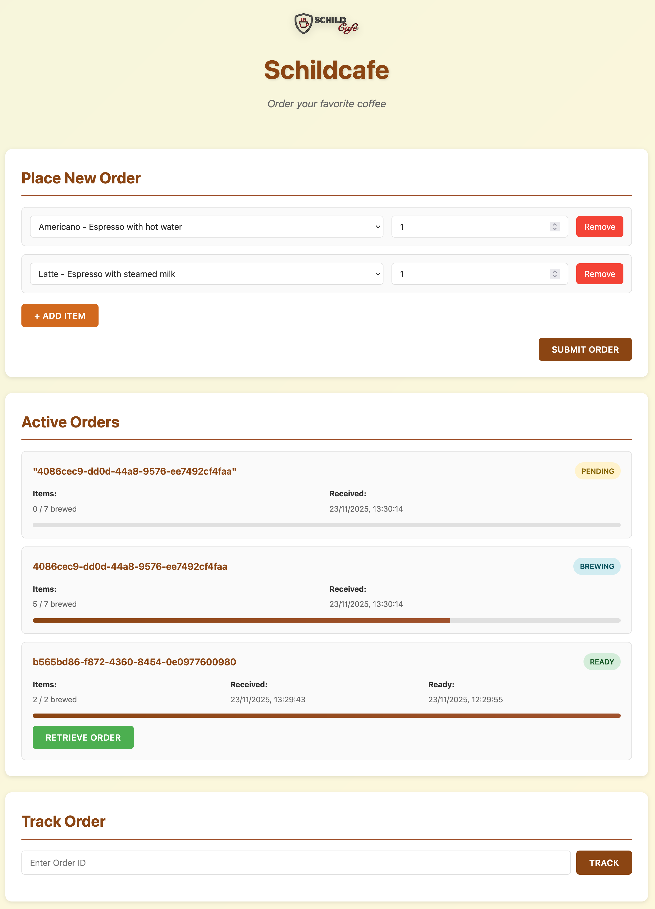

# Schildcafe GUI by Cursor with Auto model selector

This version of the application was generated by Cursor in auto mode.

## Prompt

The following prompt was given:

> Make a beautiful single page application "Schildcafe" without the use of any framework.
> The application is a frontend to the Servitor defined in the `swagger.json` OpenAPI specification.
> Add functionality to submit new orders with multiple products.
> Add functionality to follow the order's status and to retrieve it once finished.
> Use the logo in `assets/logo.png` as the logo of the application.
> The API base URL and the list of available items should be loaded from a `config.json`.

## Issues

The order retrieval functionality does not work, it can't find the order in the response.

Additional prompt to fix the issue

> It seems the code is struggeling to parse the API response of the active orders.

This did still require a reload after submitting the order.

> It still fails to load a new order after submitting without refreshing the page.

This caused the new order to be listed twice in the list

> Now the order is listed twice until the next reload.

It would not load updates unless the page was refreshed.

> Now it is not loading updates unless the page is refreshed.

This restored the issues with double entries and incomplete updates.
While the Changelog was created on the first prompt, it was not populated later.

## Result

This is the final view.



Run with e.g.

```shell
docker run -it --rm -d -p 8000:80 --name schildcafe-nginx-server -v .:/usr/share/nginx/html nginx
```
