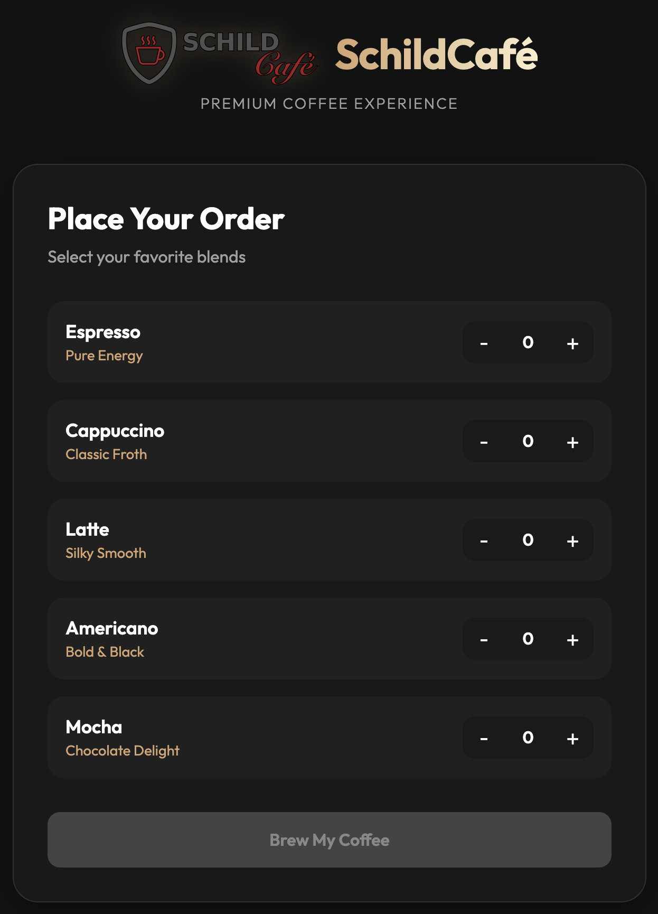
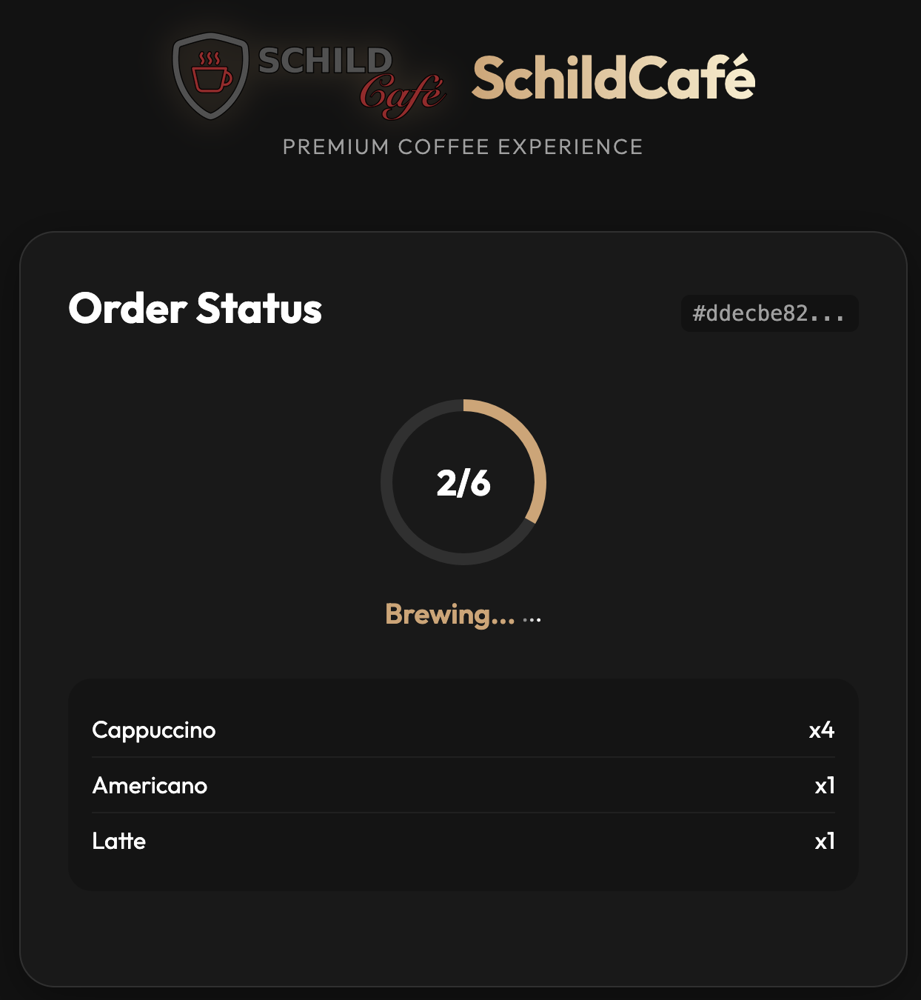
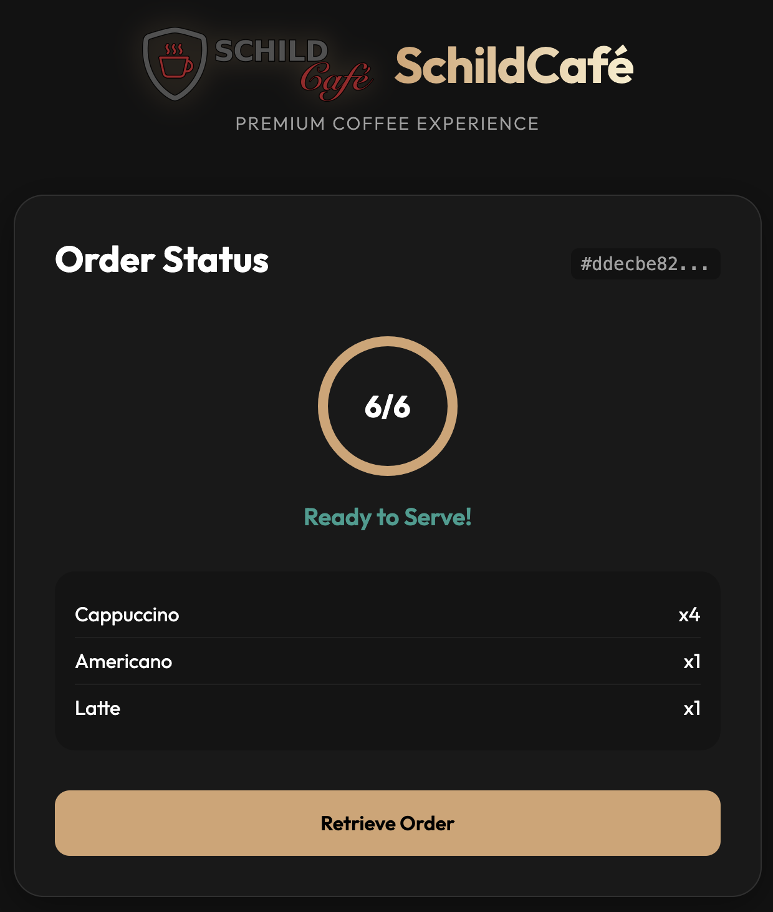
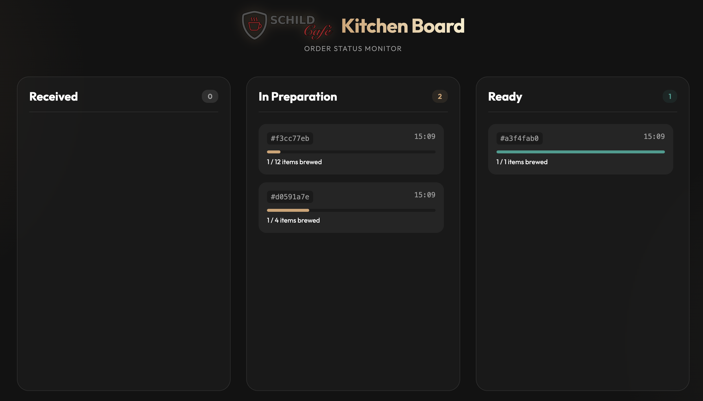

# Schildcafe GUI by Google Antigravity

This version of the application was generated by Google Antigravity using the Gemini 3 Pro (High) model.

## Prompt

The following prompt was given:

> Make a beautiful single page application "Schildcafe" without the use of any framework.
> The application is a frontend to the Servitor defined in the `swagger.json` OpenAPI specification.
> Add functionality to submit new orders with multiple products.
> Add functionality to follow the order's status and to retrieve it once finished.
> Use the logo in `assets/logo.png` as the logo of the application.

## Issues

The order retrieval functionality does not work, it can't find the order in the response.

Additional prompt to understand the issue:

> make sure to include the currentOrderId in the log message @app.js#L141-142

The following direct prompt lead it to fix the issue

> @app.js#L135-136 this is not the correct format of the response from the api

## Revisions

The following prompt was given to add dynamic loading of API url and products.

> The API_BASE_URL and the list of available items should be loaded from a config.json

## Result

These are the final views.





Run with e.g.

```shell
docker run -it --rm -d -p 8000:80 --name schildcafe-nginx-server -v .:/usr/share/nginx/html nginx
```

## Extension

Creating a dashboard for staff

> Create a second SPA, reusing the existing assets and design.
> This should be a "kitchen board" that shows the status of the cafe,
> i.e. orders received, in preperation and progress.

The final view


